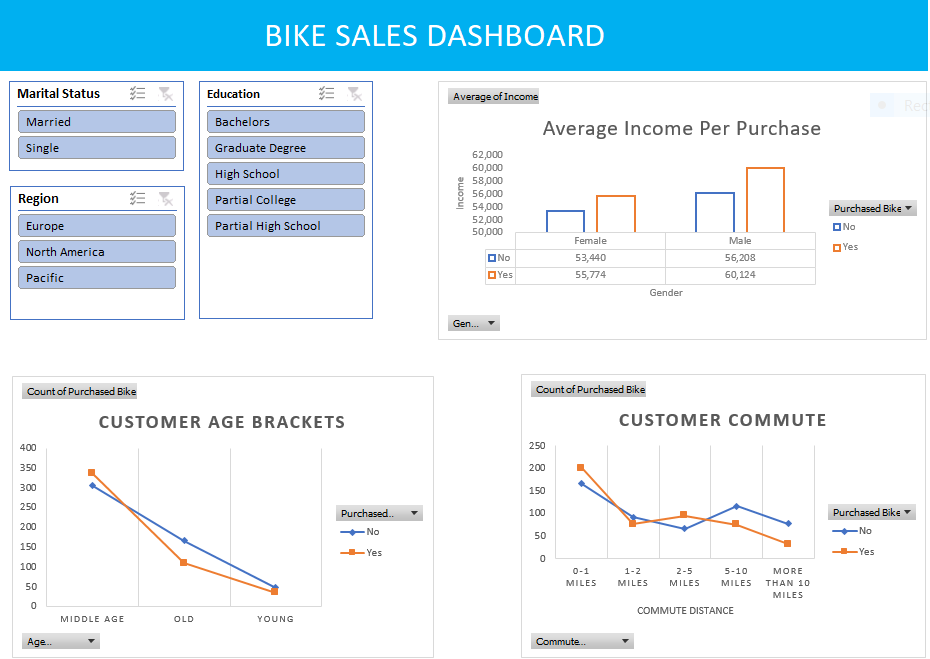

# Excel Data Analysis Project
This project utilizes a bike buyers dataset to create interactive pivot tables and visual dashboards, encompassing data preprocessing, cleaning, and visualization.

## Project Objective:
The objective of this project is to analyze the bike buyers dataset to gain insights into customer demographics and purchasing behavior. Specifically, the project aims to:
- Identify trends in average income per purchase and age distribution of buyers.
- Evaluate the relationship between customer commute distances and bike purchases.
- Provide an interactive dashboard that allows stakeholders to filter and visualize data based on key attributes like region, marital status, and education level.

The goal is to support data-driven decision-making for marketing strategies and product development in the biking industry.

---

## Dataset Used:
[Dataset](https://github.com/sarfarazalamgit/excel-data-analysis-project/blob/main/Excel%20Project%20Dataset.xlsx)

---

## Questions (KPIs):
1. **What is the average income of bike buyers?**
   - Analyzing average income levels among purchasers to identify economic demographics.
  
2. **Which age groups are most likely to purchase bikes?**
   - Understanding customer age brackets to target marketing efforts effectively.
  
3. **What are the common commute distances of bike buyers?**
   - Assessing the distances customers travel to evaluate the practicality of bike usage.
  
4. **How do marital status and education level influence bike purchasing decisions?**
   - Investigating correlations between demographic factors and buying behavior.
  
5. **What regional differences exist in bike purchases?**
   - Identifying geographic trends to tailor regional marketing campaigns.

---

## Process:
1. Verify data for any missing values and anomalies, and sort out the same.
2. Ensure data is consistent and clean with respect to data type, data format, and values used.
3. Create pivot tables according to the questions asked.
4. Merge all pivot tables into one dashboard and apply slicers to make it dynamic.

---

## Dashboard:

---

## Project Insights:
- Male bike buyers have an average income of **$60,124**, whereas female bike buyers have an average income of **$55,774**.
- The middle age group is most likely to purchase bikes.
- The most common commute distance for bike buyers is **0-1 Miles**.
- Married individuals are buying fewer bikes compared to singles.
- Those with a bachelor's degree bought the most bikes (**169**) compared to any other education level.
- Buyers from the North American region purchased the most bikes (**220**) compared to other regions.

---

## Final Conclusion:
To improve the sales of the Bike Store, a strategic marketing plan focused on middle-aged individuals (30-49 years) residing in the North American region should be implemented. This demographic represents a key consumer segment, as they often make significant lifestyle purchases. The approach should include targeted digital marketing campaigns and personalized promotions to capture their attention.
